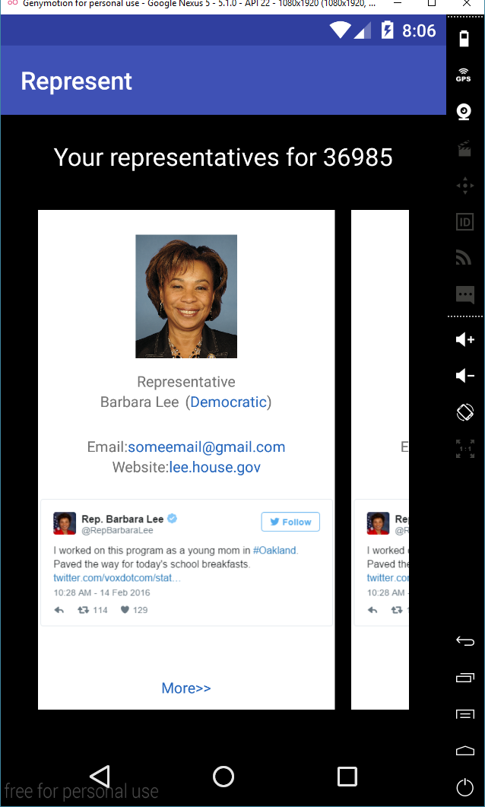
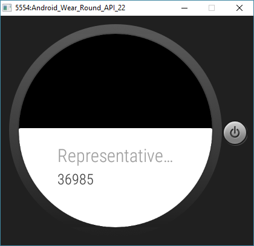

# PROG 02: Represent!

The Represent! app is an application for mobile and wear that shows the user the congressional representatives and the 2012 election results for their location.

## Authors

Sarah Au ([sau@berkeley.edu](mailto:sau@berkeley.edu))

## Demo Video

See [Prog 02-B](https://youtu.be/QFAewoNA12g)

## Screenshots

## Acknowledgments

* Thanks to CS160 Staff for providing methods to connect the Phone and Watch
* [StackOverflow](http://stackoverflow.com/questions/5745814/android-change-horizonal-progress-bar-color) for the code to change the progress bar color
